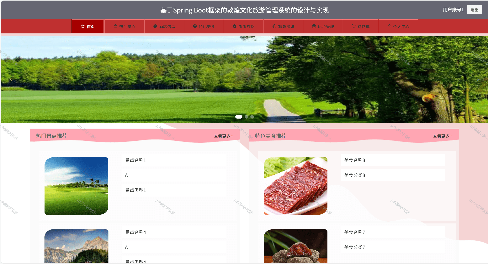
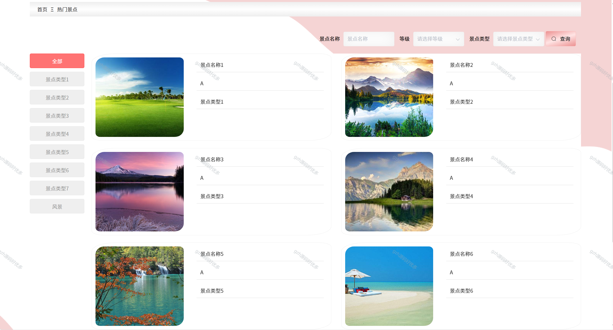

# springbootA341
springbootA341敦煌文化旅游管理系统+LW+PPT
 
## 查看主页获取源码 

### 一、关键词

敦煌文旅管理系统，敦煌文化与旅游管理系统，敦煌文旅综合管理系统

### 二、作品包含

源码+数据库+万字设计文档+PPT+全套环境和工具资源+本地部署教程

### 三、项目技术

前端技术：Html、Css、Js、Vue2.0、Element-ui 
后端技术：Java、SpringBoot2.0、MyBatis

  
### 四、运行环境（以下版本亲测，其他版本未知，请自测）

开发工具：IDEA/eclipse  + VSCODE

数据库：MySQL5.7（最低要5.7版本）

数据库管理工具：Navicat10以上版本

环境配置软件： JDK1.8 + Maven3.6.3

前端Nodejs：14

浏览器：谷歌浏览器

### 五、项目介绍

项目编号：springbootA341

敦煌文化旅游管理系统是在实际应用和软件工程的开发原理之上，运用java语言以及SpringBoot框架进行开发。首先要进行需求分析，分析出敦煌文化旅游管理系统的主要功能，然后设计了系统结构。整体设计包括系统的功能、系统总体结构、系统数据结构和对系统安全性进行设计；最后要对系统进行测试，还要对测试的结果进行总结和分析，为以后系统的维护提供方便，也为以后类似系统的开发提供参考和帮助。这种个性化的网络系统管理更重视相互协调和管理合作,能激发管理者的创造性和主动性,这对敦煌文化旅游管理系统来说非常有益。

### 六、运行截图

